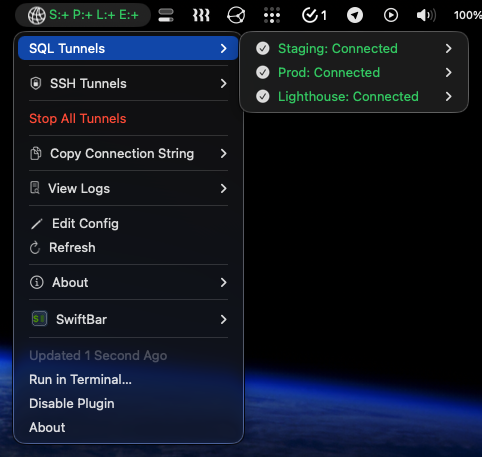

# Tunnel Toggle

A one-click tray tool for managing **Google Cloud SQL Auth Proxy** and **SSH tunnels** — on both **macOS** (via a [SwiftBar](https://swiftbar.app) menu bar plugin) and **Linux** (via a system-tray indicator + systemd service). Ships with a `tunnel` CLI too.



## Features

- Start/stop Cloud SQL Proxy and SSH tunnels from your menu bar / system tray
- Color-coded status: all connected / partial / none
- Per-tunnel and bulk start/stop controls
- Copy connection strings to the clipboard
- Auto-refreshing status (every 5 seconds)
- A `tunnel` CLI for terminal-only workflows
- Configure any number of tunnels via a simple JSON file
- **Edit Config** opens `tunnels.json` in an editor, and changes are hot-reloaded

## How it works

Each entry in `tunnels.json` maps a remote database (or SSH forward) to a local port. Tunnel Toggle launches `cloud-sql-proxy` (or `ssh -N`) per tunnel, tracks each process by PID, and reflects live status in a tray icon. The tray front-ends and the CLI all drive the same helper scripts under `lib/`, so status stays consistent however you interact with it.

## Platform support

| Platform | Front-end | Installer |
|----------|-----------|-----------|
| macOS    | SwiftBar menu bar plugin | `./install.sh` |
| Linux    | StatusNotifierItem tray daemon (Python/GTK) + systemd user service | `./install-linux.sh` |
| Any      | `tunnel` CLI | none — run it directly |

---

## Linux setup

### 1. Dependencies

The tray daemon is a small Python/GTK app that publishes a StatusNotifierItem. Install the runtime bits with your package manager:

```bash
# Arch
sudo pacman -S --needed jq python-gobject gtk3 libayatana-appindicator

# Debian / Ubuntu
sudo apt install jq python3-gi gir1.2-gtk-3.0 gir1.2-ayatanaappindicator3-0.1

# Fedora
sudo dnf install jq python3-gobject gtk3 libayatana-appindicator-gtk3
```

You also need [`cloud-sql-proxy`](https://cloud.google.com/sql/docs/mysql/sql-proxy) (v2) on your `PATH` for SQL tunnels, and the [gcloud CLI](https://cloud.google.com/sdk/docs/install) authenticated with Application Default Credentials:

```bash
gcloud auth application-default login
```

> **Tray requirement:** the indicator needs an SNI-capable system tray. KDE Plasma shows it natively; GNOME needs the *AppIndicator and KStatusNotifierItem* extension; wlroots compositors (Sway, Hyprland) need a bar with an SNI tray module such as Waybar. No tray? Use the `tunnel` CLI instead — the daemon is optional.

### 2. Configure

```bash
cp tunnels.json.example tunnels.json
# edit tunnels.json with your tunnels (see Configuration below)
```

### 3. Install

```bash
./install-linux.sh
```

This validates your dependencies and config, then writes a `tunnel-tray.service` systemd **user** unit pointing at wherever you cloned the repo, and enables it. The tray icon appears immediately and starts on every login.

Useful commands:

```bash
systemctl --user status tunnel-tray.service     # is the tray running?
journalctl --user -u tunnel-tray.service -f     # tray logs
systemctl --user restart tunnel-tray.service    # explicit restart (optional)
```

Editing `tunnels.json` is picked up automatically: the tray watches the file and reloads within 5 seconds, so a restart is only needed as a fallback. Use **Edit config** in the menu to open it in your default editor, or **Reload config** to force an immediate reload. If a save is temporarily invalid JSON, the tray keeps the previous config and logs the error.

---

## macOS setup

Install the prerequisites via [Homebrew](https://brew.sh):

```bash
brew install jq
brew install cloud-sql-proxy   # for SQL tunnels
brew install --cask swiftbar
```

Authenticate ADC for SQL tunnels:

```bash
gcloud auth application-default login
```

Then:

```bash
cp tunnels.json.example tunnels.json
# edit tunnels.json with your tunnels
./install.sh
```

Launch SwiftBar and, when prompted, point its plugin folder at the location the installer reports. The Tunnel Toggle appears in your menu bar.

The menu's **Edit Config** item opens `tunnels.json` in TextEdit. SwiftBar re-runs the plugin every 5 seconds, so saved changes appear automatically — no restart needed.

---

## Configuration

All tunnel definitions live in `tunnels.json` (gitignored, so your details stay local). Open it with **Edit Config** from either tray menu, or just edit the file directly — changes are hot-reloaded (within 5s on macOS and Linux).

Tunnel processes are tracked by a PID file under `~/.tunnel-toggle/`, keyed by tunnel name. If a PID file is missing — for example after renaming a tunnel in `tunnels.json` — the helpers fall back to finding the running process by its command line (matching the forward/host or instance/port) and re-adopt it, so a rename can't orphan a live tunnel.

```json
{
  "proxy_binary": "/home/you/.local/bin/cloud-sql-proxy",
  "tunnels": [
    {
      "name": "dev",
      "label": "Dev",
      "instance": "my-project:us-central1:my-db-dev",
      "port": 3307,
      "auto_iam_authn": true
    }
  ],
  "ssh_tunnels": [
    {
      "name": "cortex",
      "label": "C",
      "forward": "-L 8420:127.0.0.1:8420",
      "host": "cortex@example.com",
      "opts": ""
    }
  ]
}
```

### SQL tunnel fields

| Field      | Required | Description                                                      |
|------------|----------|------------------------------------------------------------------|
| `name`     | Yes      | Short identifier (used in the CLI and filenames, e.g. `dev`)     |
| `instance` | Yes      | GCP connection string: `project:region:instance`                 |
| `port`     | Yes      | Local port to bind (e.g. `3307`)                                 |
| `label`    | No       | Display name in the tray (defaults to capitalized `name`)        |
| `auto_iam_authn` | No | Pass `--auto-iam-authn` to the proxy. Required for Cloud SQL instances that use IAM database authentication (defaults to `false`) |

### SSH tunnel fields

| Field     | Required | Description                                               |
|-----------|----------|-----------------------------------------------------------|
| `name`    | Yes      | Short identifier (e.g. `cortex`)                          |
| `forward` | Yes      | Forward spec: `-L local:remote:port` or `-R remote:local` |
| `host`    | Yes      | SSH target: `[user@]host`                                 |
| `label`   | No       | Display name in the tray (defaults to capitalized `name`) |
| `opts`    | No       | Extra SSH options (e.g. `"-p 2222 -i ~/.ssh/key"`)        |

The resulting SSH command is: `ssh -N ${opts} ${forward} ${host}`

### Top-level fields

| Field          | Required | Description                                                  |
|----------------|----------|--------------------------------------------------------------|
| `proxy_binary` | No       | Path to `cloud-sql-proxy` (auto-detected from `PATH` if omitted) |

> **Note:** the SQL proxy is launched bound to `--address 0.0.0.0` so containers (e.g. an MCP server) can reach it via `host.docker.internal`. On shared or untrusted networks, remember the local port is reachable from your LAN while a tunnel is up.

## CLI

The `tunnel` script works everywhere, no tray required:

```bash
./tunnel status              # show all tunnel statuses (default)
./tunnel up [name|all]       # start tunnel(s)
./tunnel down [name|all]     # stop tunnel(s)
./tunnel restart [name|all]  # restart tunnel(s)
./tunnel logs <name>         # tail a tunnel's logs
```

Lower-level helpers (used by the tray) are available too:

```bash
./lib/proxy-ctl.sh start|stop|toggle|status|copy <name|all>   # SQL tunnels
./lib/ssh-ctl.sh   start|stop|toggle|status|copy <name|all>   # SSH tunnels
./lib/bulk-ctl.sh  start|stop                                 # everything
```

## Uninstall

- **macOS:** `./uninstall.sh` (stops tunnels, removes the SwiftBar symlink, cleans up state).
- **Linux:** `systemctl --user disable --now tunnel-tray.service && rm ~/.config/systemd/user/tunnel-tray.service`, then `./tunnel down all`.

## Troubleshooting

- **Tunnel won't start** — check logs at `~/.tunnel-toggle/sql/<name>.log` or `~/.tunnel-toggle/ssh/<name>.log`, or `./tunnel logs <name>`.
- **Port already in use** — `ss -tlnp | grep <port>` (Linux) or `lsof -i :<port>` (macOS).
- **SQL auth errors** — run `gcloud auth application-default login`.
- **Tray icon missing (Linux)** — confirm your desktop has an SNI tray (see the note above); check `systemctl --user status tunnel-tray.service`.
- **Menu is stale after a config change** — the tray reloads changes within 5s; if it doesn't, use **Reload config** in the menu or `systemctl --user restart tunnel-tray.service`.
- **Can't stop a tunnel after renaming it** — the helpers find a running process by command line and re-adopt it, so `./tunnel down <name>` works under the new name. If you renamed a tunnel and the old process is still bound to its port, run `./tunnel down <newname>` (or kill the PID shown by `lsof -i :<port>`).
- **SSH host key changed** — remove the old key from `~/.ssh/known_hosts`.
- **SSH key passphrase** — load the key into ssh-agent: `ssh-add ~/.ssh/your_key`.

## License

[MIT](LICENSE)
